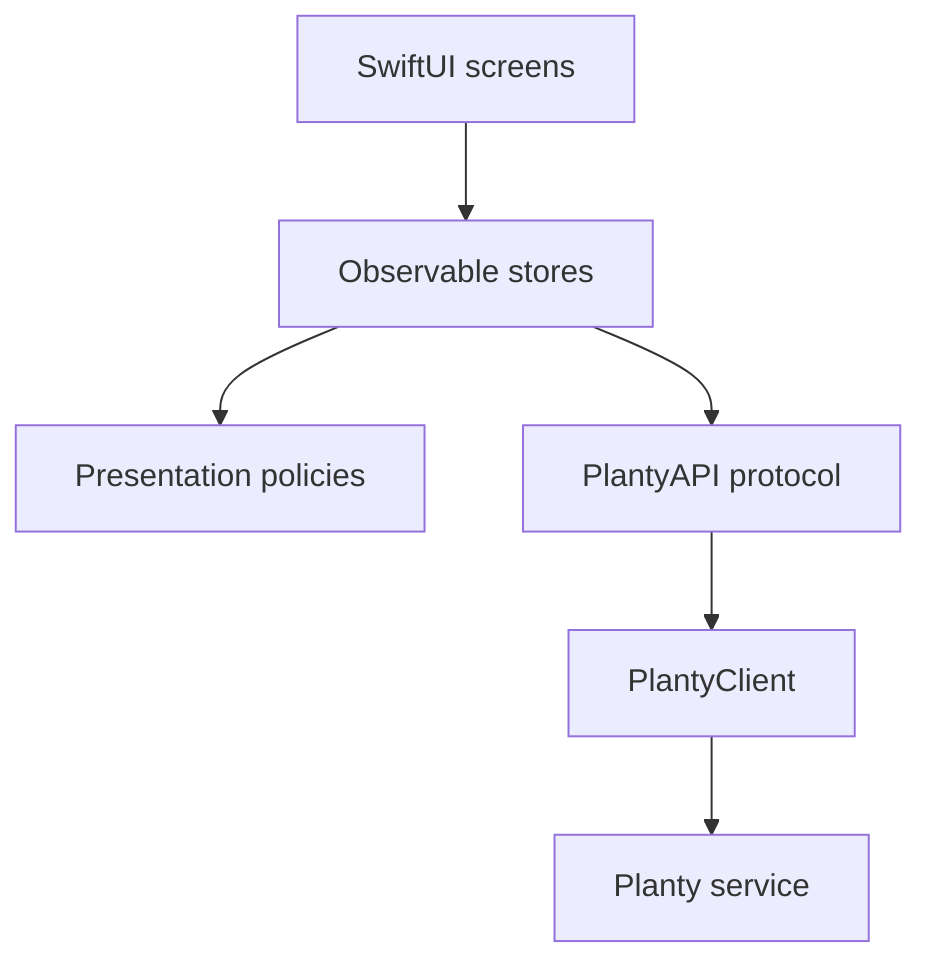

# Planty for iOS

Planty for iOS is the field app for deciding and recording what to do while standing beside a plant.
It uses Swift 6.3, Swift 6 language mode, SwiftUI, and iOS 26, and it keeps no garden database of its own.

The current product principles are in [design/UI-CONCEPT.md](../design/UI-CONCEPT.md), current screen behavior is in [design/SCREENS.md](../design/SCREENS.md), and the canonical wire contract is [api/openapi.json](../api/openapi.json).
[design/Prototype/](../design/Prototype/) is historical visual exploration rather than a source of shipped behavior.

## Build and test

```sh
cd ios
xcodebuild -project Planty.xcodeproj -scheme Planty \
  -sdk iphonesimulator -destination 'platform=iOS Simulator,name=iPhone 17' \
  build

xcodebuild -project Planty.xcodeproj -scheme Planty \
  -sdk iphonesimulator -destination 'platform=iOS Simulator,name=iPhone 17' \
  test
```

Open the project with `open Planty.xcodeproj`.
The target uses a file-system synchronized group, so adding a Swift file under `Planty/` does not require a project-file edit.

## Configuration

The base URL and optional bearer token resolve in this order:

1. Values entered in Settings, with the URL in `UserDefaults` and the token in the Keychain.
2. `PLANTY_BASE_URL` and `PLANTY_API_TOKEN` embedded through `Planty-Info.plist` at build time.

The service requires a deployment-scoped bearer token for every application route.
The token is optional only while editing Settings so the app can explain an incomplete configuration before making a request.

Settings has **Save and test**, which calls `/healthz` and proves API reachability.
Its notification diagnostics separately show permission, APNs registration, token upload, environment, server acceptance, and a real APNs test delivery.

## App structure

The app has four tabs:

- **Today** shows current care actions and garden incidents, distinguishes calm from stale or incomplete evidence, and opens room-grouped care rounds.
- **Capture** takes or imports a photograph, identifies or selects a plant, saves the timeline entry, and records quick care.
- **Plants** opens the searchable library and each plant's story, including on-demand photo analysis, before-and-after care follow-ups, resumable chat history, photo overlays, and printable QR labels.
- **More** contains bounded household experiments, the one highest-value missing evidence input, away mode, cold shelter state, owner questions, harvest history, postmortem lessons, owner updates, and settings.

On iPad the tab hierarchy becomes a sidebar-adaptable layout instead of stretching the phone tab bar.
Notification taps can open Today, Capture, Settings, or a named plant, and archived plants remain reachable through the Plants library.
The App Intent named **Start Plant Care Round** can be placed in Shortcuts and on the Lock Screen without giving Shortcuts access to garden state.



`PlantyAPI` is the test seam.
Screens do not touch `URLSession`, and generated path and enum code comes from the repository's OpenAPI contract.

| Layer | Path |
| --- | --- |
| Wire models | `Planty/Models/` |
| HTTP, updates, dates, and errors | `Planty/Networking/` |
| Observable application state | `Planty/State/` |
| Colors and shared controls | `Planty/DesignSystem/` |
| Screens | `Planty/Screens/` |

## Truthfulness rules

Stale data must never render as calm.
The service's `stale_since`, digest age, and latest garden-wide run outcome all participate in freshness, and a stale calm verdict becomes unknown while a stale urgent verdict remains urgent.

Unknown toxicity must never render as reassurance.
Unknown is outside the safe-to-severe color ramp and ranks above safe when the app summarizes mixed audience ratings.

A failed write must remain retryable.
Photo intake, care completion, reminder completion, and consultation flows keep user input when the server call fails, while idempotency keys make safe retries possible where an action records care.

Health is evidence, not lifecycle state.
Unknown remains different from zero, arbitrary signed corrections append history, and a zero score never archives a plant without a separate explicit decision.

An Incident Radar card is a hypothesis, not a diagnosis.
It preserves each affected plant's individual action and explicitly says that correlated timing does not establish causation.

## Notifications and distribution

The app requests notification permission, registers with APNs, and uploads its production or sandbox token to Planty.
The exported IPA must contain the matching `aps-environment` entitlement in the signed application, and the release workflow verifies that exact signature before publishing.

The public install page is [fledge.theoutdoorprogrammer.com/a/zone.stout.Planty](https://fledge.theoutdoorprogrammer.com/a/zone.stout.Planty).
`fledge.stout.zone` is an internal LAN verification route used by the deployment environment, not the user-facing distribution URL.
The app checks the Fledge feed embedded at release time and can offer a newer build.

## Testing

The suite uses Swift Testing and stubbed transports, so normal tests require no live service or network.
It covers configuration precedence, request method and path, decoding of real Go-shaped JSON, freshness and care-state resolution, stores, completion idempotency, capture metadata, photo intake, notes, reminders, garden workflows, update checks, and generated-contract drift.
CI and releases run the suite on the iPhone 17 simulator.

## Implementation traps

- Use `PlantObservation`, not `Observation`, because the latter shadows the Observation module used by `@Observable` macro expansion.
- Use `RelativeDateTimeFormatter` when the reference date matters; `.formatted(.relative:)` silently uses the system clock.
- Prepare the camera only while Capture is selected because `TabView` constructs neighboring tabs eagerly.
- Treat camera unavailability as a supported state and keep the Photos picker available for simulators.
- Use `PLANTY_START_TAB` only in DEBUG screenshot runs.
- Inspect the exported app's code-signing entitlements when debugging APNs, not only the provisioning profile or App ID capability.
