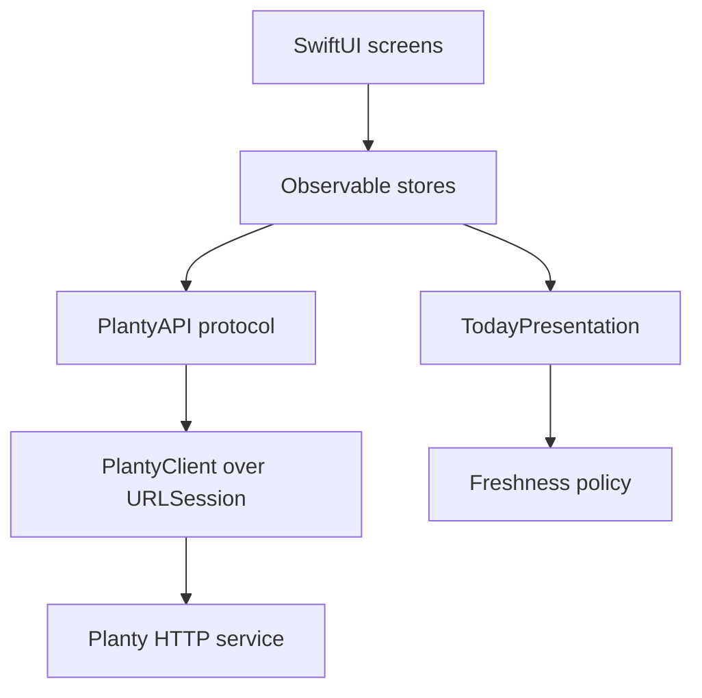

# Planty for iOS

The field app.
It answers one question: what should I do while I am standing here with this plant?

Swift 6.3 toolchain, Swift 6 language mode, SwiftUI, iOS 26.
It is a client of the HTTP service in this repo and keeps no database of its own.

The design this implements is `design/UI-CONCEPT.md`, `design/SCREENS.md` and `design/DESIGN-NOTES.md`.
The wire contract is `docs/DATA-MODEL.md`.
`design/Prototype/` is untouched and stays the visual reference.

## Build and run

```sh
cd ios
xcodebuild -project Planty.xcodeproj -scheme Planty \
  -sdk iphonesimulator -destination 'platform=iOS Simulator,name=iPhone 17 Pro' \
  build
```

Tests:

```sh
xcodebuild -project Planty.xcodeproj -scheme Planty \
  -sdk iphonesimulator -destination 'platform=iOS Simulator,name=iPhone 17 Pro' \
  test
```

Open it in Xcode with `open Planty.xcodeproj`.
The app target uses a file-system synchronized group, so a new `.swift` file under `Planty/` joins the build with no project edit.

## Configuration

Nothing is hardcoded.
The base URL and bearer token resolve in this order, first match wins:

1. What the user typed in Settings. The URL lives in `UserDefaults`; the token lives in the **Keychain**, never in defaults.
2. `PLANTY_BASE_URL` and `PLANTY_API_TOKEN`, substituted into `Planty-Info.plist` at build time.

Neither present is a real state the app names out loud, rather than a screen that looks calm with nothing behind it.

Bake the values in at build time:

```sh
xcodebuild ... PLANTY_BASE_URL=https://planty.example PLANTY_API_TOKEN=your-token build
```

Or leave them out, launch, and use the profile button on Today.
Settings has a **Save and test** button that hits `/healthz` and reports what happened.

## What talks to what



`PlantyAPI` is the seam.
Screens never touch `URLSession`, which is what lets the state logic be tested without a network or a clock.

| Layer | Where |
| --- | --- |
| Wire models | `Planty/Models/` |
| HTTP client, coders, errors | `Planty/Networking/` |
| Observable state and the calm/stale rule | `Planty/State/` |
| Colours and shared controls | `Planty/DesignSystem/` |
| Screens | `Planty/Screens/` |

## The rule this app exists to honour

**Stale data must never render as calm.**

`Digest.freshness(now:knownPlantCount:policy:)` decides, and its precedence is deliberate:

1. The service's own `stale_since` outranks everything.
2. Then the digest being older than the policy allows.
3. Then a run that finished having checked zero plants while plants exist.

`TodayPresentation.make` turns that into one of eight states.
Calm and stale are different screens with different words and different colour, and the mascot appears in one and never the other.

The asymmetry in `CareState.resolve` matters just as much: staleness can take reassurance away, never an alarm.
A stale `none` verdict becomes `Unknown`; a stale `urgent` verdict stays `Urgent`.

`FreshnessPolicy.maxAge` defaults to **36 hours**.
`DESIGN-NOTES.md` lists "what makes a daily verdict current enough for the calm state" as an open question; 36 hours is the answer this implementation picked, because the run is daily, one missed morning is explainable and two is not.
Change it in one place.

## Testing

92 tests, Swift Testing, no network.

- `DateDecodingTests` — Go writes RFC3339 with up to nine fractional digits and none at all when zero, which no single `ISO8601DateFormatter` reads. `PlantyDateFormat` clips the fraction to three digits and tries both.
- `ModelDecodingTests` — real Go-shaped JSON, snake_case keys, unknown enum fallback, calibration maths, and `Plant.risk` matching the Go `Plant.Risk()` it mirrors.
- `PlantyClientTests` — a stubbed `URLProtocol`: auth header, query building, status-to-error mapping, malformed bodies.
- `FreshnessTests`, `TodayPresentationTests`, `LibraryStatusTests` — the calm/stale rule from every angle.
- `TodayStoreTests`, `CaptureStoreTests` — postponing never acknowledges, completing records before acknowledging, a failed upload never drops the photo.

## Verified against a live service

The networking layer has been driven end to end against a mock service shaped like the Go handlers, and Today's calm, action and stale states were each confirmed on an iOS 26.5 simulator.

## What is stubbed, and why

| Thing | State | Why |
| --- | --- | --- |
| **Diagnosis replies** | `StubDiagnosisService` returns the design's mock copy | `docs/DATA-MODEL.md` documents no diagnosis endpoint at all. `RemoteDiagnosisService` is written against a proposed `POST /v1/plants/{slug}/diagnosis` and swapping it in is one line in `AppSession`. Settings says "Sample answers, not connected" so nobody mistakes canned text for a reading. |
| **Photo bytes** | Placeholder surfaces, with the real accessibility description | Photos carry a `storage_key` into MinIO and nothing documents how a client turns that into a URL. Guessing one that 404s is worse than an honest placeholder. `PlantPhotoView` is the single place to wire it. |
| **Photo upload body** | multipart with `photo`, `taken_at`, `caption` | The endpoint is documented, its body is not. Assumption is marked in `PlantyClient.uploadPhoto`. |
| **Timeline shape** | separate `observations` / `photos` / `verdicts` / `sensors` / `readings` arrays, all optional | `/v1/plants/{slug}/timeline` is documented as "merged" without a shape. This mirrors the style of the one handler that exists, and the app merges client-side into story chapters. Every key is optional so a partial service still renders. |
| **Sensor calibration** | read-only list in Settings | `PATCH /v1/sensors/{id}` is documented but not implemented server-side. |
| **Away mode, post-mortem, ask-the-owner** | absent | Checklist section 7, no endpoints yet. |
| **Notifications** | absent | Deep links need a push payload contract that does not exist. |
| **Full-screen photo comparison scrubber** | absent | Needs real photo bytes first. |

## Endpoints the service has not shipped

The client implements the whole documented contract, but only some of it is live in `internal/api` today.
Missing ones surface as a normal error state, never as calm.

Live: `GET /v1/plants`, `POST /v1/plants`, `GET /v1/plants/{slug}`, `DELETE /v1/plants/{slug}`, `GET|POST /v1/plants/{slug}/observations`, `GET /healthz`.

Not yet: `GET /v1/today`, `PATCH /v1/plants/{slug}`, `POST /v1/plants/{slug}/photos`, `GET /v1/plants/{slug}/timeline`, `POST /v1/verdicts/{id}/ack`, `GET|POST /v1/sensors`, `POST /v1/harvests`.

Today is the screen that needs `/v1/today` most, so it is the first one worth shipping.

## Notes for whoever picks this up

- **`PlantObservation`, not `Observation`.** The model type cannot be called `Observation`: that shadows the module name the `@Observable` macro expands against, and the failure is a wall of unrelated macro errors.
- **`RelativeAge.phrase` uses `RelativeDateTimeFormatter`**, not `.formatted(.relative:)`. The latter takes no reference date and silently uses the system clock, which made a fixed-clock test print "last year".
- **The camera is only prepared while Snap is selected.** `TabView` builds neighbouring tabs eagerly, and asking for the camera before the user has opened Snap is how a permission prompt gets denied.
- **Simulators have no camera.** `CameraAvailability.unavailable` is a first-class state with a Photos picker, so the whole flow is exercisable without a device.
- **`PLANTY_START_TAB`** is a DEBUG-only environment variable that opens the app straight onto a tab, for screenshot runs: `SIMCTL_CHILD_PLANTY_START_TAB=plants xcrun simctl launch <device> zone.stout.Planty`.
- **Code signing is off** for the simulator (`CODE_SIGNING_ALLOWED=NO`). Turn it back on and set `DEVELOPMENT_TEAM` for a device build.
- **The mascot is a lavender seal**, from `design/logo/animals/planty-manatee.png`. Several design docs still describe a pink starfish; `CHECKLIST.md` section 9 is the one that is current.
